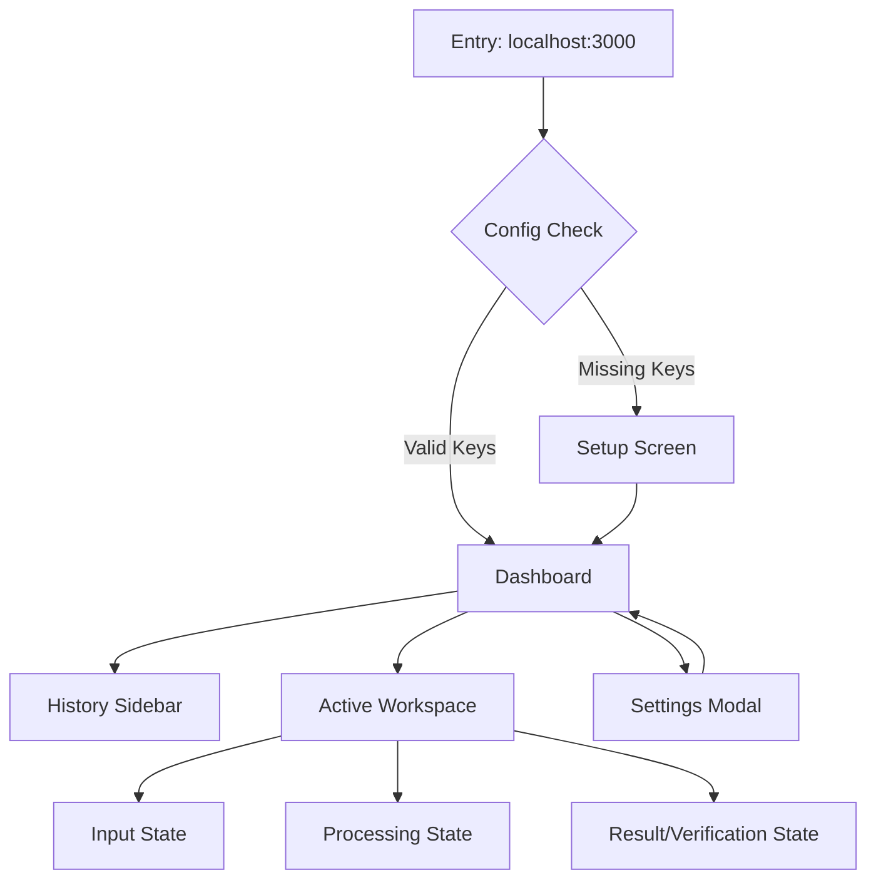

# AgentForge: Application Flow Documentation

**Version:** 1.0  
**Status:** Architecture Baseline  
**Role:** Senior UX Architect & Product Designer  

---

## 1. ENTRY POINTS

AgentForge is designed for local-first operations.

*   **CLI:** `agentforge start` (Launches the server and opens the browser).
*   **Web Console:** `http://localhost:3000` (Main interaction interface).
*   **Direct API:** `POST /api/task` (For programmatic execution by other local tools).

---

## 2. CORE USER FLOWS

### A. User Onboarding / First Use

**Goal:** Ensure the environment is ready (API Keys present).

#### HAPPY PATH
| Step | Action | Response |
| :--- | :--- | :--- |
| **Screen Name** | Setup Wizard | Initial landing if `.env` is missing or incomplete. |
| **UI Elements** | Input fields for GitHub Token, OpenWeather API Key, and LLM Provider Key. | "Check Connection" button. |
| **User Action** | Enters required API keys. | Clicks "Save & Launch". |
| **Validation** | Format check (e.g., `ghp_` for GitHub). | Validates connectivity via ping to services. |
| **Next State** | Dashboard. | System writes to local `.env`. |
| **Success Criteria**| App navigates to Dashboard; "Online" status indicator turns green. | |

---

### B. Main Task Execution

**Goal:** Submit a natural language task and receive a validated result.

#### HAPPY PATH
| Step | Action | Response |
| :--- | :--- | :--- |
| **Screen Name** | Dashboard / Workspace. | The primary interaction hub. |
| **UI Elements** | Large text input (Prompt), "Run Agent" button, Progress timeline. | Result viewport (JSON/Markdown). |
| **User Action** | Types "Get weather in London and create a GitHub issue in 'repo-x' with the forecast". | Clicks "Run". |
| **System Response** | Updates status: `Planning...` -> `Executing...` -> `Verifying...`. | Final result card appears with "Verified" badge. |
| **Validation** | LLM output must match JSON schema for tools. | Verifier agent confirms API responses match expected outcome. |
| **Next State** | Results View. | History sidebar updates with the new task. |
| **Success Criteria**| Task status: `COMPLETED`. Artifacts created (e.g., GH issue link visible). | |

#### ERROR STATES
*   **Invalid Input:** UI shows "Clarification Needed" if the prompt is too vague to plan.
*   **API Failure:** If GitHub is down, the Executor returns an error; the UI displays "Execution Failed" with the specific API error message.
*   **Timeout:** If the LLM takes >30s, the UI shows "Agent Timed Out" with a "Retry" button.
*   **Malformed LLM Output:** If Planner produces invalid JSON, the system triggers 1 auto-retry before reporting "Planning Error" to the user.

#### EDGE CASES
*   **User Refreshes Page:** State is persisted in local sqlite/localStorage; UI restores the current task progress.
*   **Multiple Tasks:** UI disables the "Run" button during active execution (Single-thread focus for 24h build).
*   **Network Offline:** App shows "Local Mode Only" and disables API-dependent tools.
*   **Partial Results:** If Weather succeeds but GitHub fails, the Verifier marks the task as `PARTIAL` and highlights the failed step.

---

### C. Settings / Configuration

**Goal:** Update keys or switch models.

#### HAPPY PATH
| Step | Action | Response |
| :--- | :--- | :--- |
| **Screen Name** | Settings. | Modal or separate route. |
| **UI Elements** | Form with existing keys (masked), Model selection dropdown. | "Reset App" destructive button. |
| **User Action** | Updates OpenWeather key. | Clicks "Apply". |
| **Success Criteria**| Success toast: "Configuration Updated". | |

---

## 3. NAVIGATION MAP

---

## 4. SCREEN INVENTORY

| Route | Access | Purpose | UI Elements | Actions | States |
| :--- | :--- | :--- | :--- | :--- | :--- |
| `/` | Public | Main Dashboard | Terminal View, Input Box, Sidebar | Run, View History | Loading, Idle, Processing, Success, Error |
| `/setup` | Public | First run config | Form fields, Help links | Save, Test Connection | Empty, Validating, Saving |
| `/settings` | Admin | Key Management | Masked Inputs, Toggle | Update, Reset | Idle, Saved |

---

## 5. DECISION POINTS

| Trigger | Condition | Action |
| :--- | :--- | :--- |
| **Submit Task** | IF input is < 10 chars | THEN show "Prompt too short" error. |
| **Planning Phase**| IF LLM returns non-JSON | THEN trigger `Planner_Retry_v2`. |
| **Execution Phase**| IF tool response is 401 | THEN redirect to `/settings` with "Auth Error" highlight. |
| **Verification Phase**| IF result != plan intention | THEN flag task as `FAILED` and provide "Manual Override" option. |
| **App Load** | IF `.env` exists | THEN route to `/`, ELSE route to `/setup`. |

---

**End of Documentation.**
